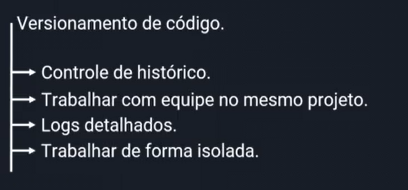

# Comandos Básicos



### Criando Repositório

Quando criamos um repositório no GitHub geralmente aparece um código para enviar os arquivos para esse repo:

<figure><figcaption>
Exemplo
</figcaption></figure>

Nessa página, irei explicar sobre esses comandos e como ir atualizando depois de ja ter dado o primeiro commit.

<mark style="color:blue;">**GIT INIT**</mark>

Inicia um repositório novo ou existente.

<mark style="color:blue;">**GIT ADD**</mark>

